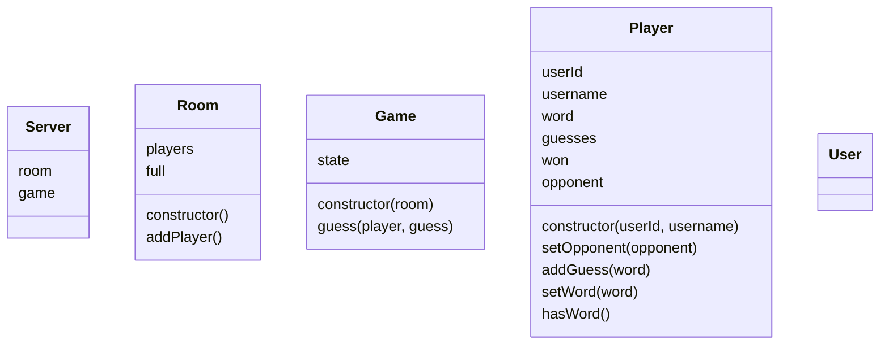

```mermaid
classDiagram

  class Server {
    room
    game
  }

  class Room {
    players
    full
    constructor()
    addPlayer()
  }

  class Game {
    state
    constructor(room)
    guess(player, guess)
  }

  class Player {
    userId
    username
    word
    guesses
    won
    opponent

    constructor(userId, username)
    setOpponent(opponent)
    addGuess(word)
    setWord(word)
    hasWord()
  }

  class User {

  }
```

# Game ModesTypes

1. Fastest player to guess opponent wins
2. Player with the least amount of guesses wins

All these modes support simultaneous turns
